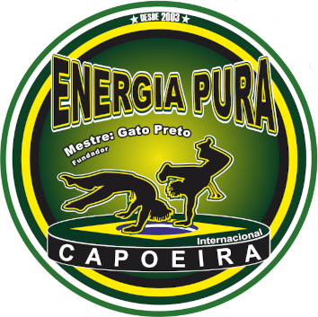

 # Energia Pura Internacional

Este é um projeto pessoal do grupo de Capoeira em que eu faço parte. 

Nosso grupo tem como missão divulgar, preservar e promover o rico universo da Capoeira, destacando não apenas a prática do jogo em si, mas também suas expressões culturais associadas, como o canto, a música e a dança. A Capoeira é mais que um esporte ou arte marcial é um símbolo de nossa ancestralidade, uma expressão viva de resistência e um laço que une comunidades por gerações. A Associação Energia Pura Internacional é mais do que um grupo, somos uma família unida pela paixão pela arte e pela tradição da Capoeira.

## 🎨 Stack utilizada

- **React** - Biblioteca para construção de interfaces de usuário.
- **TypeScript** - Superset do JavaScript que adiciona tipagem estática.
- **TailwindCSS** - Framework de CSS utilitário para estilização rápida e responsiva.
- **Shadcn/UI** - Componentes acessíveis e personalizáveis.
- **React Hook Form** - Gerenciamento de formulários com performance otimizada.
- **API do Google Maps**: Integrada para exibir um mapa na página de contato.
- **i18next**: Biblioteca para internacionalização, permitindo que a aplicação suporte múltiplos idiomas.
- **EmailJS**: Serviço para envio de e-mails diretamente do site, utilizado para enviar o conteúdo do formulário de contato.
- **Zod** - Biblioteca de validação e parsing de esquemas.

## 🛠️ Pré-requisitos

-   Node.js instalado na máquina - versão 20.17.0-LTS ou superior.
-   NPM (Node Package Manager) para instalar as dependências necessárias do projeto.

## 🛠️ Instalação

- Clone o repositório, com o comando abaixo, no seu terminal:
  - Utizando HTTPS `https://github.com/wiltonmartinsdev/capoeira-energia-pura.git` ou
  - Utilizando SSH: `git@github.com:wiltonmartinsdev/capoeira-energia-pura.git`.
- Acesse o diretório do projeto: `cd capoeira-energia-pura`.
- Certifique-se de ter o Node.js e o NPM instalados em sua máquina e depois digite no terminal o comando abaixo para instalar todas as dependências necessárias do projeto.

      npm install
    
## 🚀 Execução da Aplicação

-   Após instalar todas as dependências necessárias do projeto, agora poderá executá-lo da seguinte maneira:
-   Digite no terminal o comando abaixo:

          npm run dev

          Após esse comando, o servidor será iniciado e aparecerá a mensagem: "Local: http://localhost:" informando que o servidor esta sendo executado e mostrará a porta de execução. A partir, desta etapa podemos testar a aplicação.
## ✨ Funcionalidades

- **Responsividade**: O layout foi projetado para ser responsivo em todos os dispositivos, garantindo uma experiência de usuário fluida tanto em desktop quanto em dispositivos móveis.
- **Navegação**: Implementação de navegação entre diferentes seções da aplicação utilizando React Router.
- **Formulário de Contato**: Um formulário de contato funcional, validado com Zod e React Hook Form, que permite enviar mensagens diretamente para o e-mail do grupo, via EmailJS.
- **Multilíngue**: A aplicação suporta vários idiomas, incluindo Português do Brasil, Francês, Italiano e Inglês, facilitando o acesso para usuários de diferentes regiões.
- **Mapa Interativo**: A página de contato exibe um mapa interativo utilizando a API do Google Maps.
- **Animações**: Utilização de animações para melhorar a interatividade do site.

## 📊 Status do Projeto

-  A aplicação encontra-se finalizada, mas, podendo ser implementada novas funcionalidades no futuro.

## 📄 Licença

## 📚 Aprendizados

Durante o desenvolvimento da aplicação, adquiri uma série de aprendizados valiosos que aprimoraram minhas habilidades como desenvolvedor front-end:

- **Organização e Arquitetura de Código**: Aprendi a estruturar um projeto de maneira eficiente, organizando componentes e pastas de uma forma clara e escalável, o que facilita futuras manutenções e atualizações.

- **TypeScript**: A implementação do TypeScript me permitiu escrever um código mais seguro e confiável, minimizando erros de tipo e me forçando a pensar de forma mais cuidadosa sobre os tipos e estruturas de dados.

- **TailwindCSS e Estilização Utilitária**: Utilizar TailwindCSS foi uma experiência que mudou minha visão sobre como aplicar estilos de forma rápida e responsiva. As classes utilitárias se mostraram eficientes para manter o CSS mais limpo e focado.

- **Formulários com React Hook Form, Zod e EmailJS**: O processo de validação de formulários com `React Hook Form` e `Zod` me permitiu lidar com validações de forma mais robusta e eficiente. Além disso, integrar o EmailJS para enviar as mensagens do formulário foi uma experiência valiosa de integração com serviços externos, simplificando o envio de e-mails diretamente do site.

- **Componentização com Shadcn/UI**: Utilizar componentes pré-construídos e acessíveis me ajudou a focar mais na lógica e menos na estilização, o que acelerou o desenvolvimento e melhorou a consistência visual da aplicação.

- **Deploy e Hospedagem**: A experiência de deploy na Vercel foi muito enriquecedora, pois tive a oportunidade de resolver problemas relacionados a rotas, imagens e redirecionamentos, o que solidificou meus conhecimentos em deploy de aplicações front-end.

- **Resolução de Problemas**: Durante o desenvolvimento, enfrentei desafios significativos que aprimoraram minha capacidade de resolver problemas e buscar soluções eficazes. 
  - Enfrentei desafios como erros em formulários, comportamento de layout em dispositivos móveis e integrações com serviços externos. Cada obstáculo me ajudou a melhorar minha capacidade de resolução de problemas e a buscar soluções mais eficientes.
  - A implementação da API do Google Maps foi uma grande experiência, especialmente ao configurar as coordenadas corretas para os marcadores, adicionar ícones personalizados no InfoWindow, e lidar com a personalização dessa janela.
  - A internacionalização também foi um desafio considerável, pois configurar o i18next para suportar quatro idiomas exigiu um trabalho detalhado. Foi preciso extrair automaticamente os textos estáticos e organizar arquivos JSON com todas as traduções correspondentes a cada idioma. Esse processo me ajudou a aprimorar habilidades em gerenciamento de configuração e manipulação de conteúdo multilíngue.

Esses aprendizados contribuíram para que eu evoluísse não só tecnicamente, mas também na minha capacidade de pensar em soluções mais escaláveis e em proporcionar uma melhor experiência para o usuário final.
